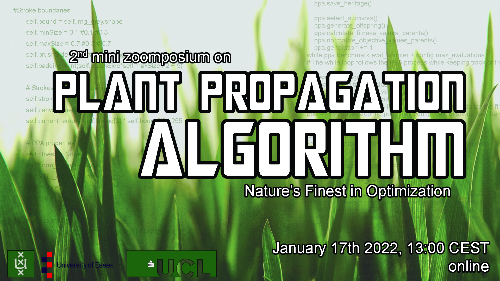

# Program (in CEST time zone)

#### 13:00 Daan van den Berg (UvA / VU Universities, Yamasan Science&Education) - PPA & TSP

Experiments conducted by Levi Koppenhol show that PPA show parameter dependence on the Euclidean Traveling Salesman Problem. However, it also shows to be unsensitive to instance specifics.

#### 13:20 Nielis Brouwer (University of Amsterdam)

TextTextTextText

#### 13:40 Eric Fraga (University College London) - Ranking solutions for fitness in PPA Multi-Objective optimization

The PPA uses fitness as the key driver for propagation.  For single objective optimization problems, a simple and effective fitness ranking can be based on the objective function value.  For multi-objective optimization, ranking the solutions in a population is more complex.  This talk presents 3 alternatives and illustrates their impact on a simple problem of the design of the operating schedule for a batch reactor.

14:00 break

Everybody makes their own coffee.

14:30 Danny Dijkzeul (University of Amsterdam, Cover Genius)

TextTextTextText

14:50 Dante Niewenhuis (University of Asmterdam, )

TextTextTextText

15:10 A possible 6th speaker 

# Register 

Register >[here](https://bit.ly/31sn8B3)< to be on the mailing list, and receive the zoom link.

Click >[here](https://bit.ly/3xZe2ru)< for a concise list of video's and papers on Plant Propagation Algorithm.

